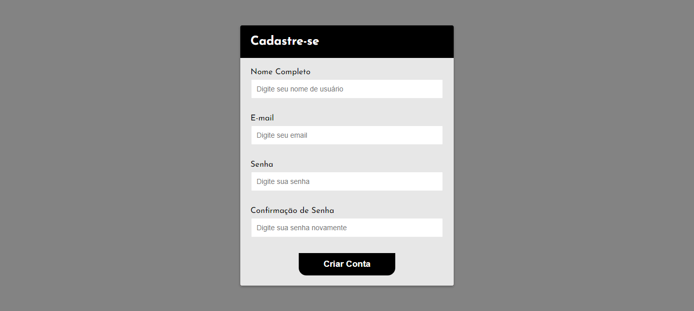

<h1 align="center">
  Formulário com Validação
</h1>

  

## Projeto - Formulário de Cadastro com Validação 

O código permite que os usuários preencham um formulário com informações como nome completo, e-mail, senha e confirmação de senha.
Ele realiza verificações para assegurar que os dados estejam corretos e no formato adequado, melhorando a precisão das informações enviadas.
O design do site prioriza a experiência do usuário, tornando o preenchimento do formulário amigável e fácil.

Tecnologias Utilizadas:
* [HTML (Linguagem de marcação):](https://www.w3schools.com/html/html_intro.asp) Utilizado para estruturar e definir o conteúdo da página, incluindo cabeçalhos, parágrafos, listas e imagens.
* [CSS (Folha de estilos em cascata):](https://www.w3schools.com/css/css_intro.asp) Utilizado para estilizar os elementos da página, definindo cores, tamanhos, fontes e layout, proporcionando uma aparência visualmente atraente.
* [JavaScript:](https://developer.mozilla.org/pt-BR/docs/Web/JavaScript) Utilizado para adicionar interatividade à página, permitindo que o usuário selecione personagens e exiba informações dinamicamente.
* [Google Fonts:](https://fonts.google.com/) Utilizado para acessar e aplicar fontes personalizadas aos textos da página, melhorando a estilização e a legibilidade.
* [GitHub Pages:](https://pages.github.com/): Plataforma de hospedagem gratuita para projetos estáticos, permitindo que o site seja acessível na web.

Créditos:
* Criado com base do Canal no YouTube | [Felipe Rocha • dicasparadevs](https://www.youtube.com/@dicasparadevs)

Implantação do Projeto no GitHub Pages: [Explore o projeto clicando aqui.](https://jcddsj01.github.io/formulario-com-validacao/)

---

## Project - Registration Form with Validation

The code allows users to fill in a form with information such as full name, email, password and password confirmation.
It performs checks to ensure that the data is correct and in the proper format, improving the accuracy of the information submitted.
The design of the website prioritizes user experience, making filling out the form user-friendly and easy.

Technologies used:
* [HTML (HyperText Markup Language):](https://www.w3schools.com/html/html_intro.asp) Used to structure and define page content, including headings, paragraphs, lists and images.
* [CSS (Cascading Style Sheets):](https://www.w3schools.com/css/css_intro.asp) Used to style the elements of the page, defining colors, sizes, fonts and layout, providing a visually appealing appearance.
* [JavaScript:](https://developer.mozilla.org/pt-BR/docs/Web/JavaScript) Used to add interactivity to the page, allowing the user to select characters and display information dynamically.
* [Google Fonts:](https://fonts.google.com/) Used to access and apply custom fonts to page texts, improving stylization and readability.
* [GitHub Pages:](https://pages.github.com/): Free hosting platform for static projects, allowing the website to be accessible on the web.

Credits:
* Created on the basis of the YouTube channel | [Felipe Rocha • dicasparadevs](https://www.youtube.com/@dicasparadevs)

Project deployment on GitHub Pages: [Explore the project by clicking here.](https://jcddsj01.github.io/formulario-com-validacao/)
